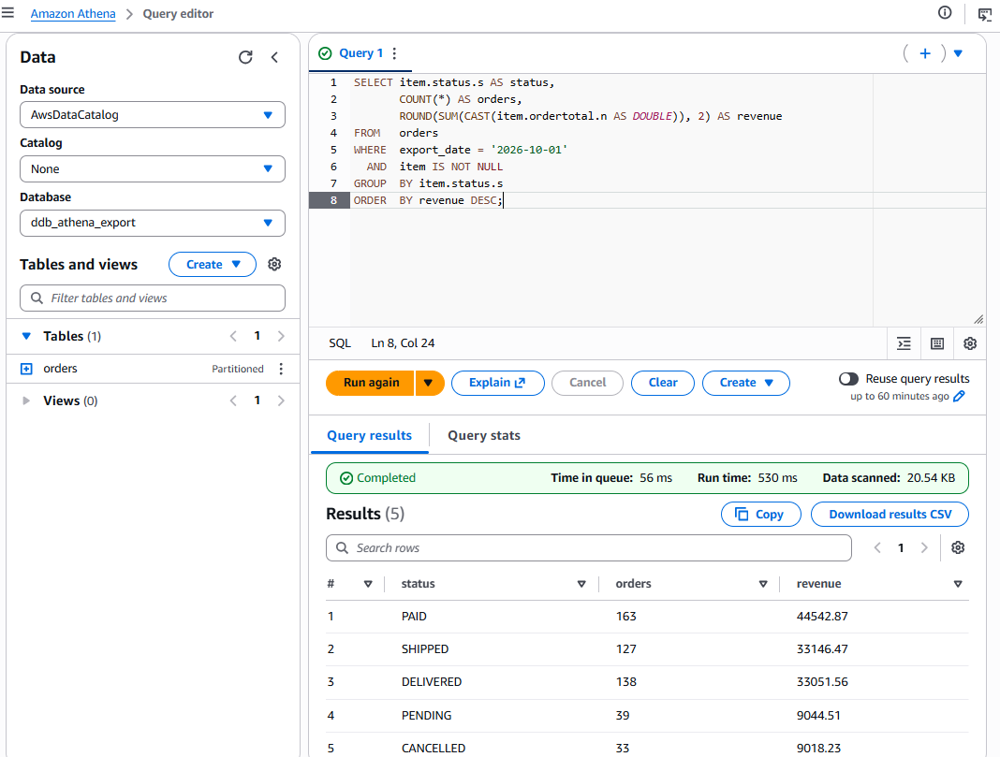
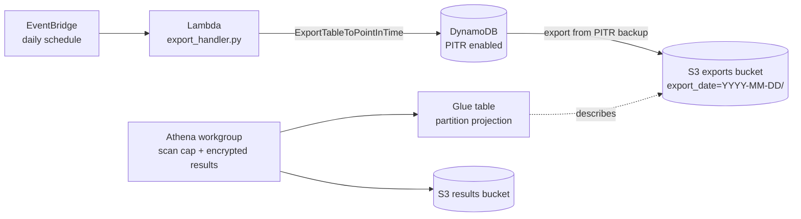
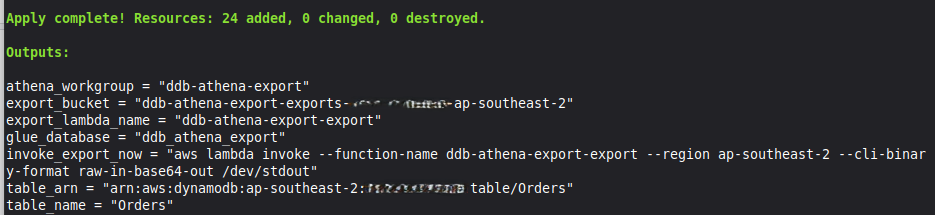
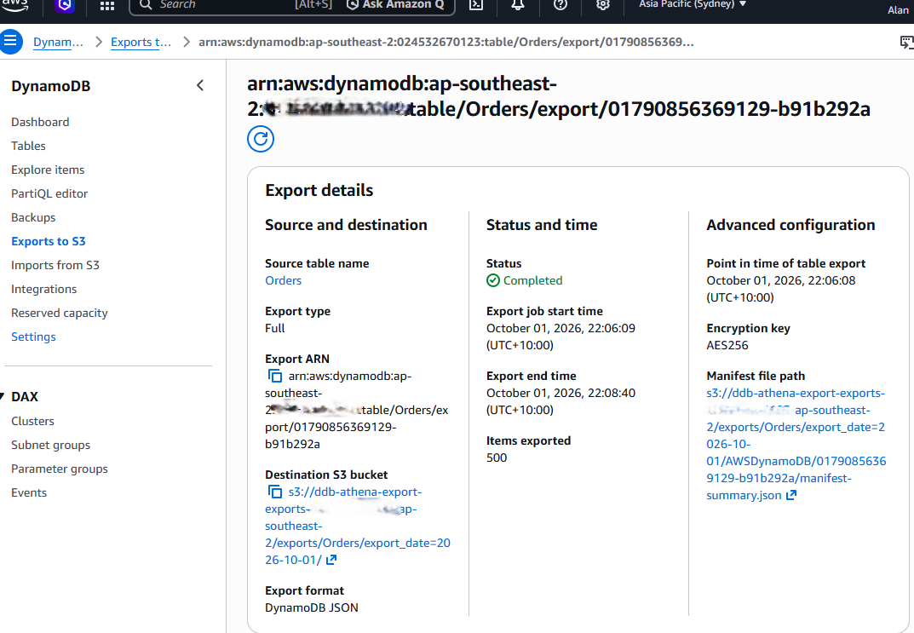
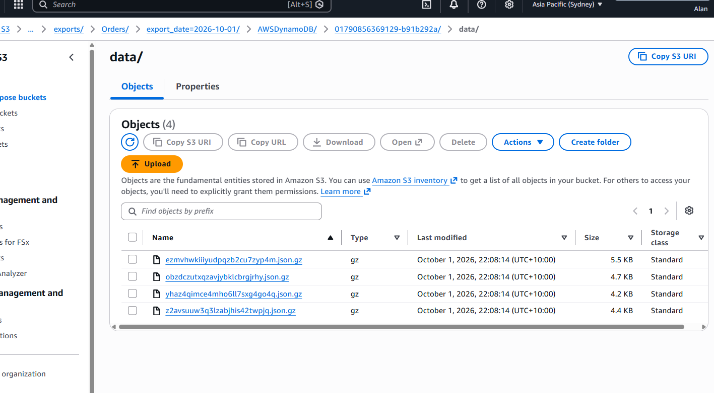

# DynamoDB → S3 → Athena analytics pipeline (Terraform)

Run analytical SQL over a DynamoDB table **without querying the table itself**.
A scheduled job exports the table to S3 from its point-in-time-recovery (PITR)
backups, and Athena queries the exported files through a Glue table.

Everything is defined in Terraform and deploys to `ap-southeast-2` by default.

## Result

500 seeded orders were exported from DynamoDB to S3 and queried by status in
Athena, scanning about 20 KB:



## Architecture



## Why this design

- **Isolation.** Exports are served from PITR backups, so they don't consume the
  table's read capacity or compete with production traffic. Analysts query S3,
  not the operational table.
- **Cheap, serverless querying.** Athena bills per data scanned; nothing runs
  when nobody is querying.
- **No crawler or manual partition repair.** `export_date` is a Glue partition projection
  column, so new daily exports are queryable immediately.
- **Guard rails.** The Athena workgroup enforces its result location, SSE-S3
  encryption and a per-query scan limit. Both buckets are private, encrypted
  and TLS-only, with lifecycle expiry. The Lambda's IAM role is limited to one
  table and one S3 prefix.

## What gets deployed

| Resource | Purpose |
|---|---|
| `aws_dynamodb_table.orders` | Source table, on-demand billing, PITR on |
| S3 exports bucket | Export data; private, SSE-S3, TLS-only, 30-day expiry |
| S3 results bucket | Athena query results; same hardening, 7-day expiry |
| Lambda + IAM role | Starts the export; least privilege (one table, one prefix) |
| EventBridge rule | Daily schedule (default 16:00 UTC) |
| Glue database + table | Schema over the export files |
| Athena workgroup + 3 saved queries | Cost-capped querying |

Terraform creates 24 resources in total.



## Repository layout

```
.
├── versions.tf        # providers
├── variables.tf       # inputs (region, table name, schedule, retention, scan cap)
├── main.tf            # DynamoDB table + S3 buckets
├── export.tf          # Lambda, IAM, EventBridge schedule
├── athena.tf          # Glue database/table, Athena workgroup, saved queries
├── outputs.tf
├── lambda/export_handler.py
├── scripts/seed_orders.py
└── docs/              # screenshots
```

## Deploy

Requirements: Terraform ≥ 1.5, AWS credentials with permission to create the
resources above (use a sandbox account), and Python 3 with `boto3` for the seed
script.

```bash
terraform init
terraform apply
```

## Try it

```bash
# 1. Put some fake data in the table
python scripts/seed_orders.py --table Orders --count 500

# 2. Trigger an export now instead of waiting for the schedule
aws lambda invoke --function-name ddb-athena-export-export \
  --cli-binary-format raw-in-base64-out out.json

# 3. Watch it finish (IN_PROGRESS -> COMPLETED)
aws dynamodb list-exports --table-arn "$(terraform output -raw table_arn)"
```

In the test run, a full export of 500 items completed in about two and a half
minutes:



The export writes gzipped DynamoDB JSON into a per-day folder:



Then open Athena, choose the `ddb-athena-export` workgroup and the
`ddb_athena_export` database, and run one of the saved queries. Set
`export_date` to the **UTC** date of your export:

```sql
SELECT item.status.s AS status,
       COUNT(*) AS orders,
       ROUND(SUM(CAST(item.ordertotal.n AS DOUBLE)), 2) AS revenue
FROM   orders
WHERE  export_date = '2026-10-01'
  AND  item IS NOT NULL
GROUP  BY item.status.s
ORDER  BY revenue DESC;
```

## Verified behaviour

- Athena reads the nested `AWSDynamoDB/<id>/data/` folders through partition
  projection with no extra table settings. A `GROUP BY "$path"` check returned
  the four data files, whose row counts summed to the 500 seeded items.
- The status breakdown also sums to 500.

## Tradeoffs and known limitations

- **Data is a snapshot.** Results are as fresh as the last export (daily by
  default), not real time.
- **Full exports each run.** Every export copies the whole table. Export and
  PITR are billed per GB, so large tables cost more; tune the schedule and
  retention to fit.
- **`item IS NOT NULL` filter.** Each export folder also contains manifest
  files. The JSON SerDe reads them as rows with no `item`, so queries filter
  them out. A view, or a table pointed only at `/data/` paths, would remove
  this quirk.
- **Schema is explicit.** DynamoDB is schemaless, so attributes are declared as
  Glue columns in `athena.tf` (`local.item_struct`). New attributes need a
  matching column.
- **Dates are UTC.** The partition key is the UTC date the export ran.
- **No alerting yet.** The Lambda only *starts* the export. A failed export is
  not reported anywhere automatically.

## Possible next steps

- Alarm on failed exports (CloudTrail/EventBridge) and on Lambda errors.
- Incremental exports to reduce cost on large tables.
- Convert to Parquet with a Glue job for cheaper, faster queries.
- Remote Terraform state (S3 with locking) and a CI `terraform validate` job.

## Clean up

```bash
# Buckets only delete when empty. For a throwaway demo, allow force-delete first:
terraform apply -var="force_destroy_buckets=true"
terraform destroy
```
